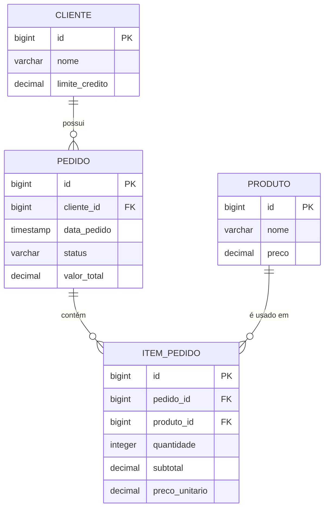

# ER Diagram - Sistema de Gerenciamento de Pedidos

## Diagrama de Entidade-Relacionamento



## Descrição das Entidades

### 1. CLIENTE
- **id**: Chave primária, identificador único do cliente
- **nome**: Nome completo do cliente (VARCHAR, 2-150 caracteres)
- **limite_credito**: Limite de crédito disponível para o cliente (DECIMAL 15,2)

### 2. PRODUTO  
- **id**: Chave primária, identificador único do produto
- **nome**: Nome do produto (VARCHAR, 2-150 caracteres)
- **preco**: Preço unitário do produto (DECIMAL 15,2)

### 3. PEDIDO
- **id**: Chave primária, identificador único do pedido
- **cliente_id**: Chave estrangeira referenciando CLIENTE
- **data_pedido**: Data e hora de criação do pedido (TIMESTAMP)
- **status**: Status do pedido ('APROVADO' ou 'REJEITADO')
- **valor_total**: Valor total calculado do pedido (DECIMAL 15,2)

### 4. ITEM_PEDIDO
- **id**: Chave primária, identificador único do item
- **pedido_id**: Chave estrangeira referenciando PEDIDO
- **produto_id**: Chave estrangeira referenciando PRODUTO
- **quantidade**: Quantidade do produto no item (INTEGER >= 1)
- **subtotal**: Subtotal calculado (quantidade × preço_unitário)
- **preco_unitario**: Preço unitário do produto no momento do pedido

## Relacionamentos

1. **CLIENTE → PEDIDO**: Um cliente pode ter muitos pedidos (1:N)
2. **PEDIDO → ITEM_PEDIDO**: Um pedido pode ter muitos itens (1:N)
3. **PRODUTO → ITEM_PEDIDO**: Um produto pode estar em muitos itens de pedidos (1:N)

## Regras de Negócio

### Validação de Crédito
- O sistema calcula o crédito utilizado baseado nos pedidos aprovados dos últimos 30 dias
- Quando um pedido é criado:
  - Calcula valor_utilizado = soma de pedidos aprovados dos últimos 30 dias
  - Calcula saldo_disponivel = limite_credito - valor_utilizado
  - Se valor_total_pedido ≤ saldo_disponivel: status = 'APROVADO'
  - Se valor_total_pedido > saldo_disponivel: status = 'REJEITADO'
- Pedidos rejeitados são armazenados para auditoria, mas não afetam o cálculo de crédito
- A janela de 30 dias é calculada a partir da data atual (rolling window)

### Consulta de Saldo em Tempo Real
- Endpoint `/clientes/{id}/credito` fornece informações atualizadas
- Cálculo dinâmico baseado na data atual
- Retorna: limite_credito, valor_utilizado, saldo_disponivel

### Cálculos Automáticos
- **subtotal** = quantidade × preco_unitario
- **valor_total** = soma de todos os subtotais dos itens do pedido
- **preco_unitario** é copiado do produto no momento da criação para manter histórico
- **valor_utilizado** = soma dos valores de pedidos aprovados nos últimos 30 dias

### Constraints e Validações
- Todos os campos obrigatórios possuem validação NOT NULL
- Preços e valores devem ser > 0,01
- Quantidades devem ser >= 1
- Nomes devem ter entre 2 e 150 caracteres
- Status do pedido é controlado pela aplicação (enum: APROVADO, REJEITADO)

## Índices Sugeridos

```sql
-- Índices para melhor performance
CREATE INDEX idx_pedido_cliente_id ON pedido(cliente_id);
CREATE INDEX idx_pedido_data ON pedido(data_pedido);
CREATE INDEX idx_pedido_status ON pedido(status);
CREATE INDEX idx_item_pedido_pedido_id ON item_pedido(pedido_id);
CREATE INDEX idx_item_pedido_produto_id ON item_pedido(produto_id);
```

## Exemplo de Dados

```sql
-- Exemplo de cliente
INSERT INTO cliente (nome, limite_credito) VALUES 
('João Silva Santos', 15000.00);

-- Exemplo de produto
INSERT INTO produto (nome, preco) VALUES 
('Notebook Dell Inspiron 15', 2800.00);

-- Exemplo de pedido aprovado
INSERT INTO pedido (cliente_id, data_pedido, status, valor_total) VALUES 
(1, '2025-08-09 10:30:00', 'APROVADO', 2800.00);

-- Exemplo de item do pedido
INSERT INTO item_pedido (pedido_id, produto_id, quantidade, subtotal, preco_unitario) VALUES 
(1, 1, 1, 2800.00, 2800.00);
```
